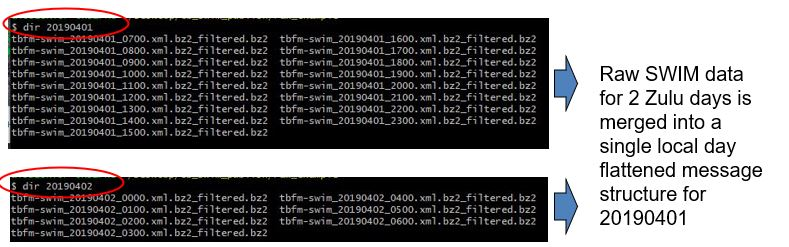
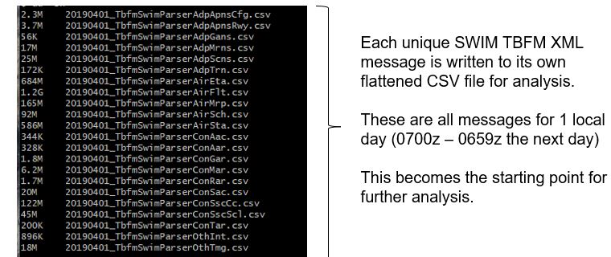
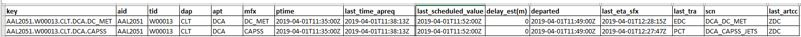

# detailedtbfmswim
The python scripts described here provide example source code that can be used for deeper dive analysis of public TBFM SWIM aviation data.

The expectation is that analysts and developers will be starting with an archive of TBFM SWIM data stored in Zulu time folder structure.
While raw storage is by Zulu day, the reports and views of the data desired are in local days.

The first step in flattening to CSV takes input files from two folders as well as a target date. The python command to perform this is listed below. In this example, we tell the script that we are interested in April 4th, 2019 and it needs to pull information from two separate zulu day archives to create one local day output. We are also asking the script to provide its output in the 'flattened_dir' directory.

> python TbfmSwimFromRawArchive.py –m archive –z 20190401 –r 20190401,20190402 –o flattened_dir 

The results of step 1 flattening are 22 distinct CSV files
This separates all the unique messages into their own CSV file
This is often helpful for analysis given each TBFM message has a different structure
It is rare to use more than 6-8 different message types, but all are stored in case they are needed
The output is not in compressed form, but for longer term storage it would benefit from compression. The uncompressed output from 04/01/2019 is 2.9GB. However, after bzip2 compression it is 339MB on disk (8.6 to 1 compression ratio)

Step 2 - Estimating TBFM Surface Delay 

Beginning with the output from step 1 processing, each SWIM AIR ‘flt’ message is parsed
The resulting output from step 2 is only those flights that are *potentially* an APREQ from TBFM
A later step will winnow this list down into a set of flights with varying levels of confidence
This step relies heavily upon the ‘std’ and ‘ctm’ messages from ‘flt’ data given SWIM has no ‘ready time’
Unfortunately, some of these messages appear to be missing from the TBFM SWIM dataset. More analysis is required to understand why these key messages are missing
The following command will pull relevant flattened CSV file data from 20190401, generate a list of potential APREQ data and output the results into a single file in the air_flt_w_delay_est directory
You will need to create the output directory 

> python TbfmSwimScheduledDataFromFly.py flattened_dir 20190401 –o air_flt_w_delay_est 

The output is approximately 2MB

Step 3 - Creating a Dataset for Analysis

Leveraging the output from both step1 and step 2, the next step is to create a more complete dataset for analysis
This pulls in data from several other flattened CSV files for this day and merges it with the output of step 2
In the process of doing so, this requires both intra-center and inter-center duplicate flight processing as described on the next slide
The following command will pull relevant data from 20190401, find the best ETAs/STAs and other relevant SWIM data to match the APREQ flight, perform quality checks on the estimated APREQ, and output the results to a single file per day
You will need to create the output directory 
The output is 73 columns of data and uses 2.7MB of disk space

> python TbfmMergedSummary.py flattened_dir  air_flt_w_delay_est 20190401 –o merged_summary 

Intra-Center Duplicate Flight Processing

One unique flight from ‘flt’ data may map to 2 or more flights in TBFM with distinct estimated times of arrival
So how do we perform the unique matching? 
There is no decoder ring, but the logic is broken into an intra-Center heuristic and inter-Center heuristic
In this example, the flight data for AAL2051 from CLT->DCA matches 2 potential meter fixes that may have caused any APREQ delay
DC_MET meter fix is EDC, using stream class DCA_DC_MET
CAPSS meter fix is arrival TBFM, using stream class DCA_CAPSS_JETS
To determine which scheduling point we should use, the meter fix which receives STA data from TBFM SWIM first is selected
The reason for this is that the scheduling activity likely happened to this meter fix first, then was shared with other TBFM processes for informational purposes

Inter-Center Duplicate Flight Processing

Once intra-Center duplicates are removed, there may still be duplicates between two distinct Centers
This often happens with extended metering or use of EDC with arrival metering when there is automatic information sharing between the Centers

To find and remove these duplicates, the merge and summary logic in step 3 looks for all flights that have the same aid, dap, apt and ptime

Each flight with the above unique keys are then iterated through and the flight with meter point closest to the origin airport is selected
The reason for this is that the meter fix closest to the tower that had the delay pass back is the most likely to have received the APREQ delay

Removing intra and inter Center duplicates is an important step to avoid double counting delay
The logic provided is believed to perform this accurately, however, additional review of this logic by TBFM developers is desired

Once these steps are completed, additional logic is applied to estimate the level of confidence we have with the delay estimate as indicated by the 'delay_trustworthy' column of the output.

